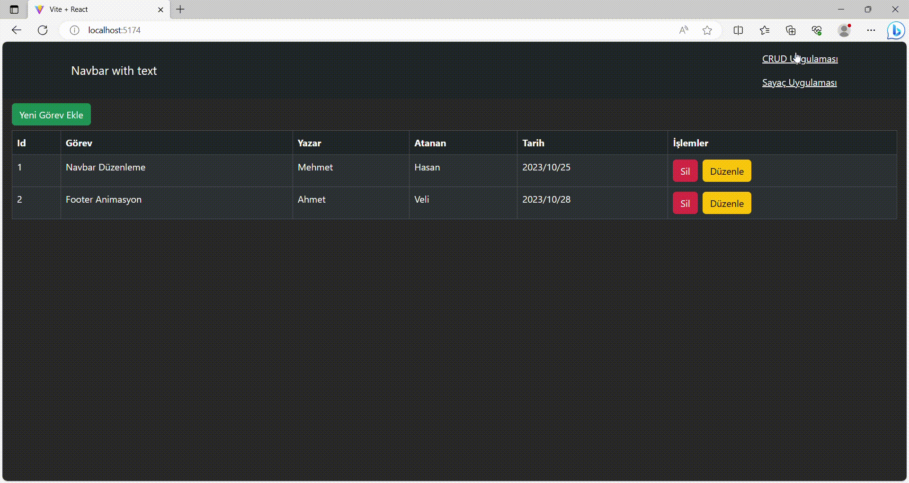

# Kurulum

Kütüphaneler;

- @reduxjs/toolkit // Redux Toolkit Kullanmak içi
- react-redux // Redux kullanımı için
- react-bootstrap bootstrap // Stillendirme için
- react-router-dom // sayfalar arası geçiş için

Kurulum Adımları;

- Slice Oluştur (counterSlice.js dosyası oluştur)
- - Slice==> Hem reducer hemde aksiyonları içerisinde barındırır
    1- createSlice() import et 2- slice için gerekli parametleri tanımlama name: slice ismi initialState:başlangıç state reducers: aksiyonları ve yapıcakları etkiyi tanımlama 3-createSlice metoundan dönen yapıyı bir değişkene aktar 4-daha sonra aktardığın değişken içerisindeki reducer ı export et

Store Oluştur (store.js)

'createStore' yerine configureStore kullanarak store oluştur
'configureStore' içerisinde thunk bizim için tanımlı gelir
reducerler içerisinde kendisi birleştiriyor
reducerları storea tanıt

storu export et

App componentini provider ile sarmalama

### 'Screen'

